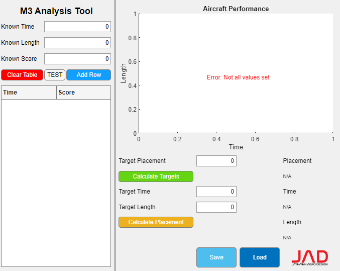
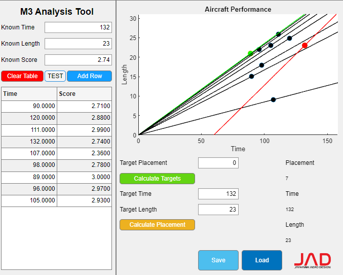
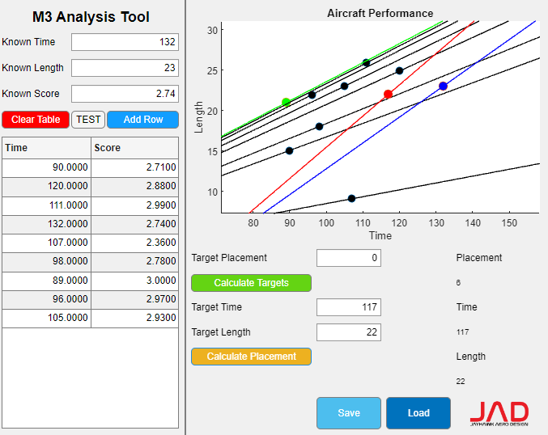
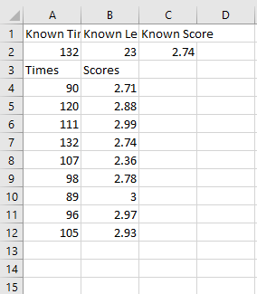
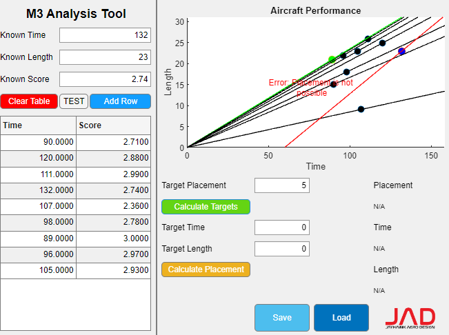

# M3-Analysis-Tool
Adaptive analysis tool for Mission 3 of the 2023 AIAA Design/Build/Fly Competition.
Mission 3 involves completing a flight route with an antenna attached to one end of the plane.
Planes are scored using dividing their performance ratio (their length divided by their time) by the maximum performance ratio.
i.e. (Lp / Tp) / (Lm / Tm), where Lp and Tp are the length and time of the plane and Lm and Tm are the length and time of the best plane.
A value of 2 is added to each score, making it a continuous value from 2 - 3.

# How to Use:
1. Input known time, length, and score
2. Input competitor times and scores
   * The tool should automatically calculate our placement
3. Calculate time and length necessary to achieve a specific placement OR
   Calculate the placement for a hypothetical time and length

# Notes:
- The red point/slope is our current / hypothetical performance
- The blue point/slope is our old / known performance
- The green point/slope is the best performance
- The slope of each competitor's point is equivalent to its performance ratio.
- The slope of our own point is calculated using our zero-length speed and our known performance point.
- You can save and load the data as a CSV
- Trying to achieve a placement that is not possible will yield an error
- You can use the TEST button to populate the tool with dummy values

# Screenshots:
First load

Populating dummy values using TEST

Calculating required length and time for target placement

Calculating placement for target length and time

Data saved to CSV

Error message for impossible placement

